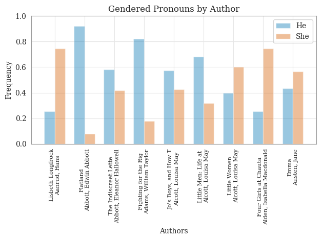
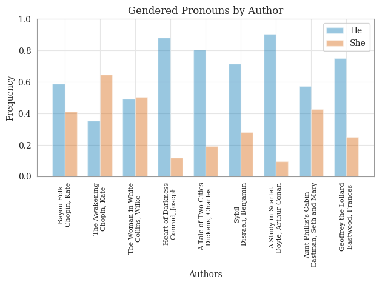
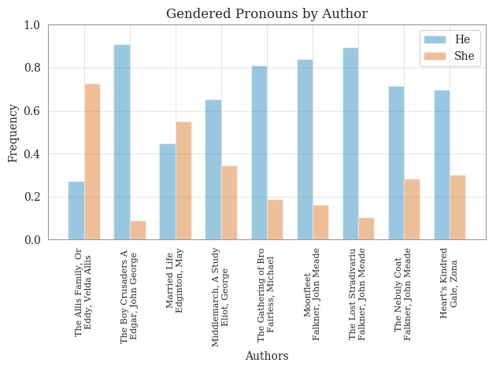
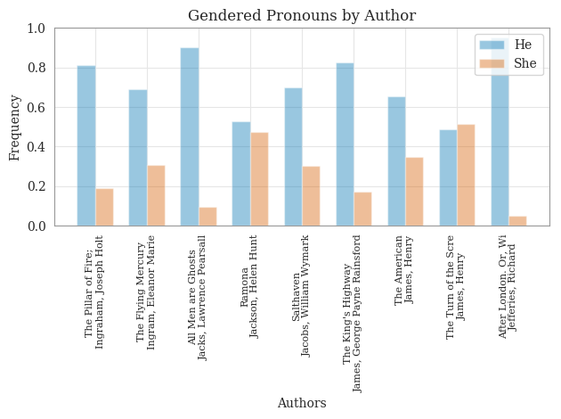
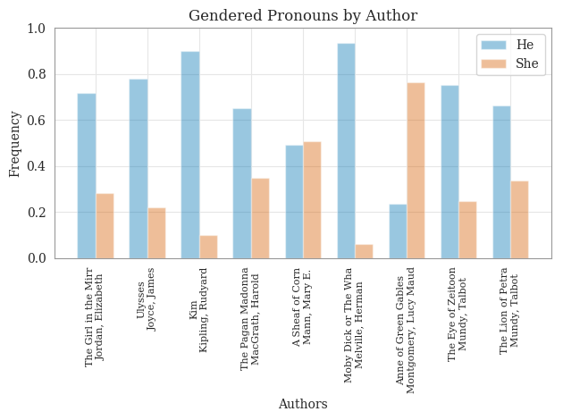
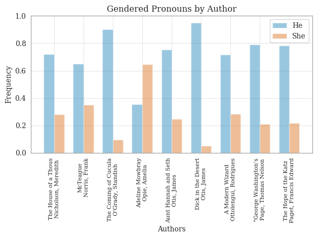
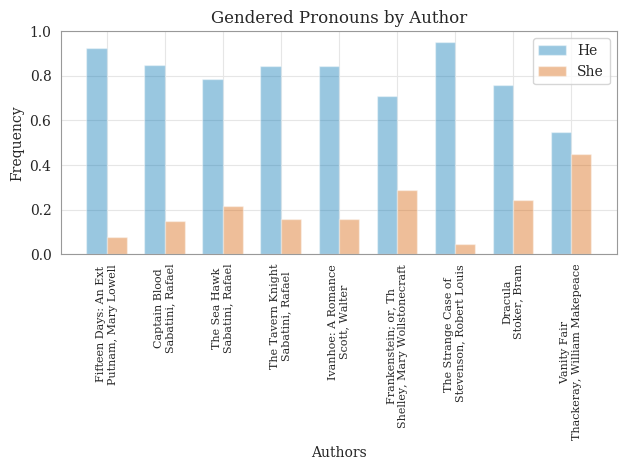

# Basic Pronoun Frequency Analysis

**The following Markdown file contains results from a basic pronoun frequency analysis. The results are binned based on characteristics of the novels such as author gender, date published, and location.**

The code used for this analysis can be found in [gender\_pronoun\_freq_analysis.py](https://github
.com/dhmit/gender_novels/blob/master/gender_novels/analysis/gender_pronoun_freq_analysis.py).

The code initially returns the relative frequency of male pronouns to female pronouns. The numbers given here are relative frequency of female pronouns. Thus, the higher the number, the more times female pronouns were used vs male pronouns in the book.
 
For example:
> A frequency of 0.4 means that 40% of the gendered pronouns in that book were female and 60% of the gendered pronouns were male.
 
The numbers listed here are means over their respective categories.
 
## By Author Gender:
 
Male Authors: 0.23341

Female Authors: 0.44838

## By Decade:

*nan means there are currently no novels in the corpus within the dates*

All dates before 1810 : 0.30164

Dates 1810 to 1819 : 0.42073

Dates 1820 to 1829 : nan 

Dates 1830 to 1839 : 0.12711

Dates 1840 to 1849 : 0.32286

Dates 1850 to 1859 : 0.39726

Dates 1860 to 1869 : 0.42883

Dates 1870 to 1879 : 0.38678

Dates 1880 to 1889 : 0.24003

Dates 1890 to 1899 : nan 

Dates 1900 on : 0.3109

## By location:

Published in England : 0.30493

Published in US : 0.32676

Published in other country : 0.38190

## Thoughts:
Just from glancing at the numbers, we noticed no trends with the exception of author gender. Female authors seem to have a 
significantly higher frequency of female pronouns over male authors.

## Examples

Below are some example graphs of notable novels and authors, and the breakdowns of their pronoun 
usage:

