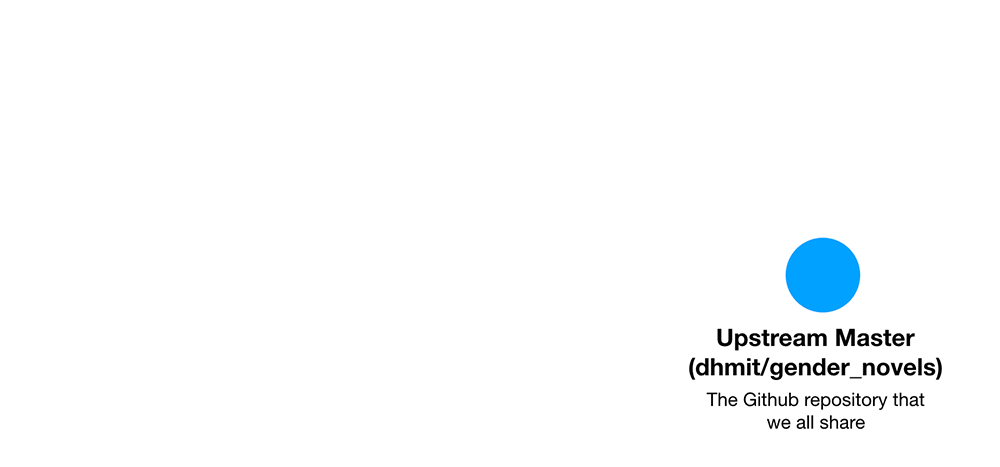
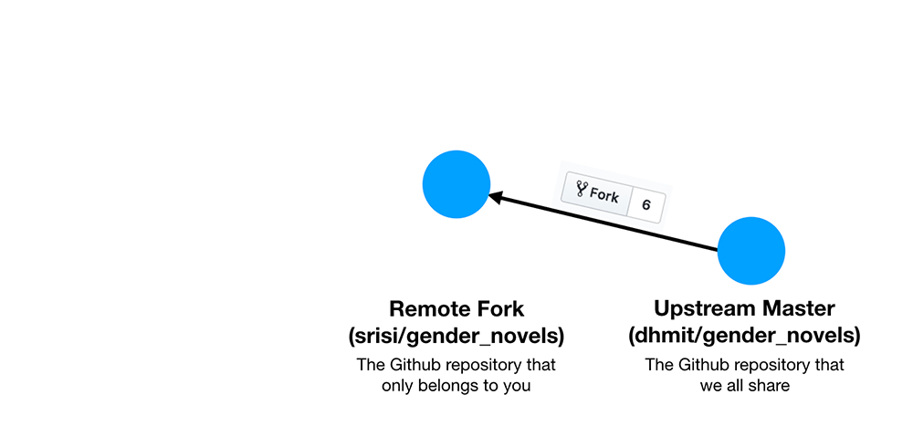
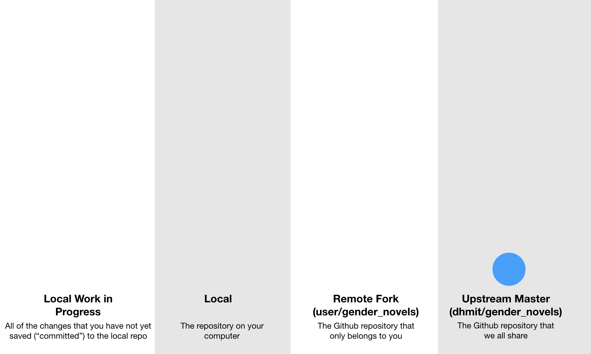
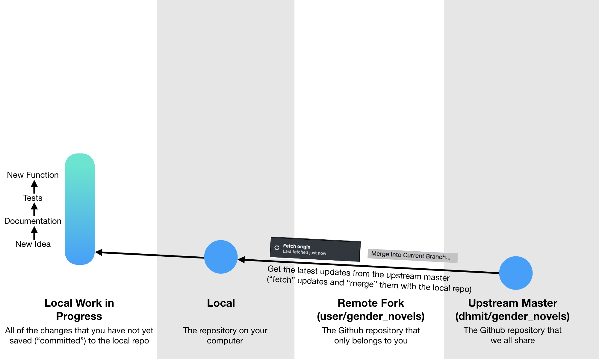
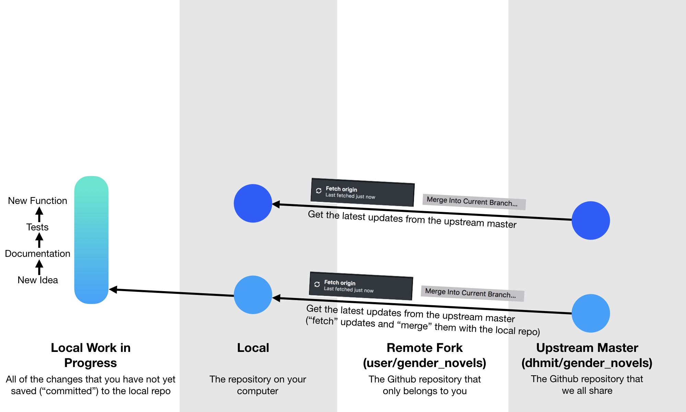
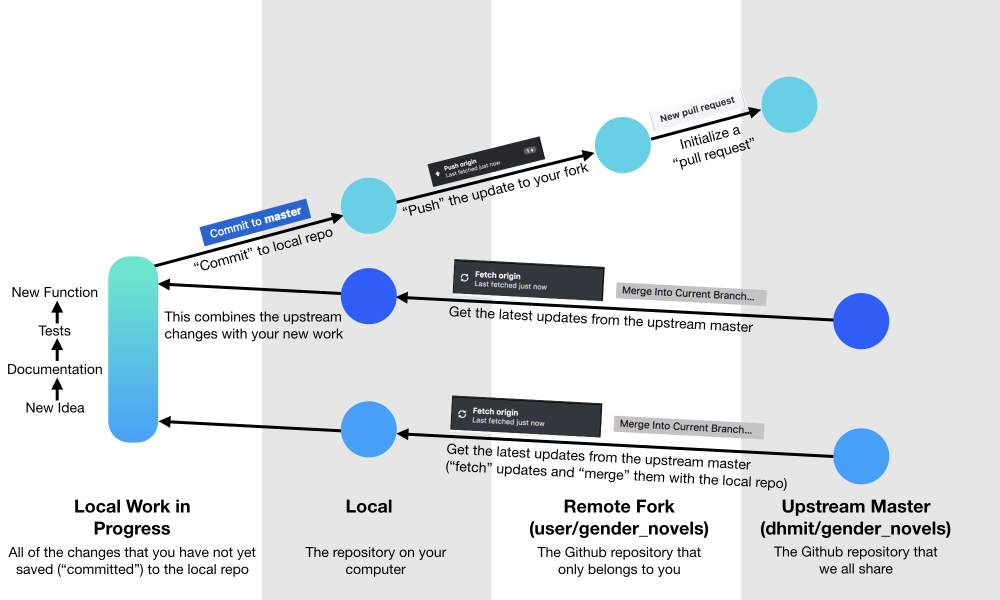
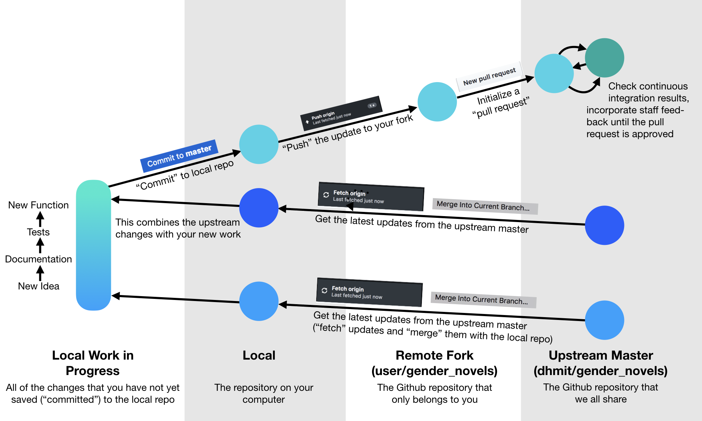
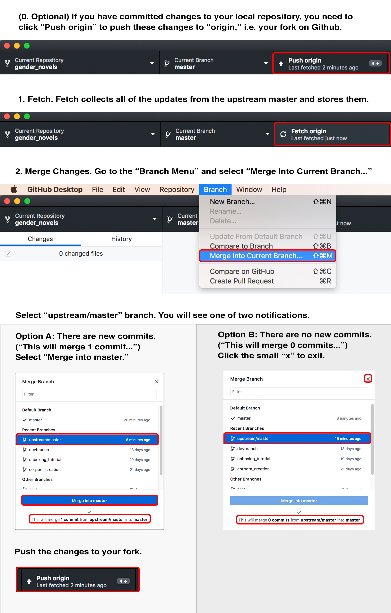
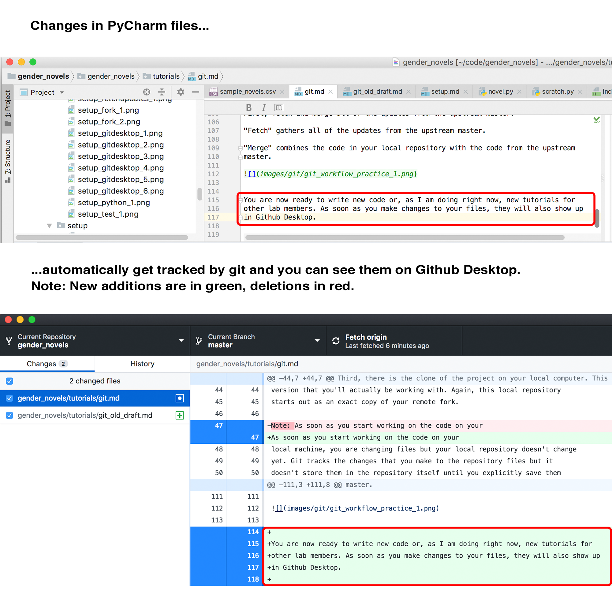
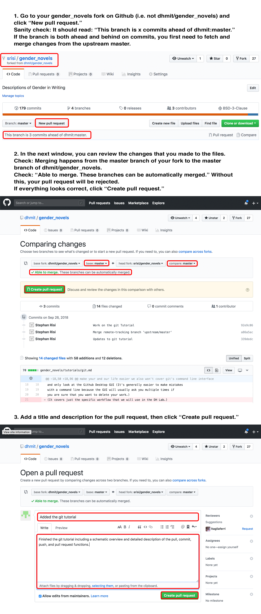

# Git Tutorial

This tutorial presupposes that you have set up git, Github, and Github
Desktop as described in the
[setup tutorial.](https://github.com/dhmit/gender_novels/blob/devbranch/tutorials/setup.md)

#### Overview

The problem with git is that it is too powerful and gives you too many options
and comes with a vocabulary of its own, filled with pushes, pulls, merges, and
branches.


This tutorial isn't a deep dive into the curious world of git. What it covers
are only the essential parts that you need to know to work in the DH Lab. To
make your and our life easier we also won't cover git's command line interface
and only look at the Github Desktop GUI (It's generally easier to make mistakes
with a command line because the GUI will usually ask you multiple times if
you are sure that you want to delete your work.)


#### General Outline: Local, Remote, and Upstream

In every project, we will work with three different versions of the same repository. You have 
already worked with all of them during the setup process.


First, there is the
[master repository](https://github.com/dhmit/gender_novels)
on Github. It contains the authoritative current version of our project. It is also the 
repository that we all contribute our documented and tested code to.



Second, there is your personal fork of the project on Github. When you set it up, this fork was 
an exact copy of the upstream master repo. However, the fork is created, this repo is under your 
control and you can use it to stage changes before submitting them to the upstream master.


Third, there is the clone of the project on your local computer. This is the version that you'll 
actually be working with. Again, this local repository starts out as an exact copy of your remote
 fork.

As soon as you start working on the code on your local machine, you are changing files but your 
local repository doesn't change yet. Git tracks the changes that you make to the repository files
 but it doesn't store them in the repository itself until you explicitly save them (called 
 "commit") to your local repository. The advantage of this process is that it makes it easy to 
 reset to an earlier state if you make a mistake.

## Workflow: Code Commits, Pushes and Pull Requests
When you work with git, your code moves from work in progress to your
Github fork and finally to the main upstream repo.

### Workflow: A Schematic Overview
Here's a schematic overview of how this works.



First, you fetch and merge any updates from the upstream master.


Then, you are ready to implement a new idea, write tests and documentation, and finally the 
necessary code.

Note: These changes are saved on your local machine but they are not yet saved in your local
git repository.


When you are ready to share your work with the whole lab, you should first fetch and merge  
updates from the upstream master--someone might have been working on the same file as you did.


This combines any potential upstream changes with your local changes.


Now, you're ready to save your work to your local repository, which is called a "commit." You can
 think of a commit as a save point in a video-game--if you make mistakes in the future, you can 
 reset to this save point.


So far, you have only saved your changes to your local machine. Next, you want to save your 
changes to your changes on your github fork. This is called a "push." You "push" your changes to 
your fork.


Finally, to share your changes with the whole lab, you initialize a "pull request." This is a
request that your code gets reviewed and, if suitable, incorporated in the main repository.


A "pull request" is different from a "push." When you push your code, the fork automatically 
takes on the state of your local repository. In contrast, when you submit a pull request, you 
are asking that your changes get incorporated into the upstream master repository. However, the 
changes won't appear in the upstream master until it passes the tests of our continuous 
integration system and a staff member or the quality assurance specialist has reviewed and 
approved them. 


### The Workflow in Practice--Which Buttons Do I Press?


#### Fetch and Merge Updates
First, fetch and merge all of the updates from the upstream master.

"Fetch" gathers all of the updates from the upstream master. 

"Merge" combines the code in your local repository with the code from the upstream master.



#### Write Documentation, Code, Tutorials...
You are now ready to write new code or, as I am doing right now, new tutorials for other lab 
members. As soon as you make changes to your files, they will also show up in Github Desktop.



#### Commit Changes
Once you are done with your changes, you should save your work by "committing" it to your local 
repository.

First, you should fetch and merge updates from the upstream master again. It's possible that 
someone else made modifications to the same files as you did and you want to have those changes 
before you commit your own changes. (See the screenshots above.)

Here's how you commit code to your local repository.


#### Push Changes to Your Github Fork
You can now "push" your changes to your fork on Github by clicking "Push origin" in Github.


#### Open a Pull Request
If you want share your code with the rest of the lab, you need to issue a "pull request."

Remember this difference: You own your own fork on Github (<Github username>/gender_novels), which 
means that you can just "push" your code there, overwriting any earlier state. However, you don't
 own the upstream master (dhmit/gender_novels). To make changes to the upstream master, you need 
 to request that your code gets incorporated in that repository. Here's how that process works.


When you have submitted a pull request, one of the staff members or the quality assurance 
specialist will review your pull request. Expect that we will often ask for further modifications
 before merging your changes into the upstream master.
 
## Troubeshooting

### Merge Conflicts
Git is great because it allows multiple people to work together on the same piece of 
software--until it gets confused about how to merge different copies of the same file. Welcome to
 the "merge conflict."
 
 A merge conflict happens when git can't merge two copies of the same file.
 
For example, the fourth line of my test.py may read as
```python
a = 10
```
On the upstream master, that same line in test.py may be
```python
a = 11
```
When trying to merge these two files, git will throw up its arms in the air and give you an error
message that looks like this:


