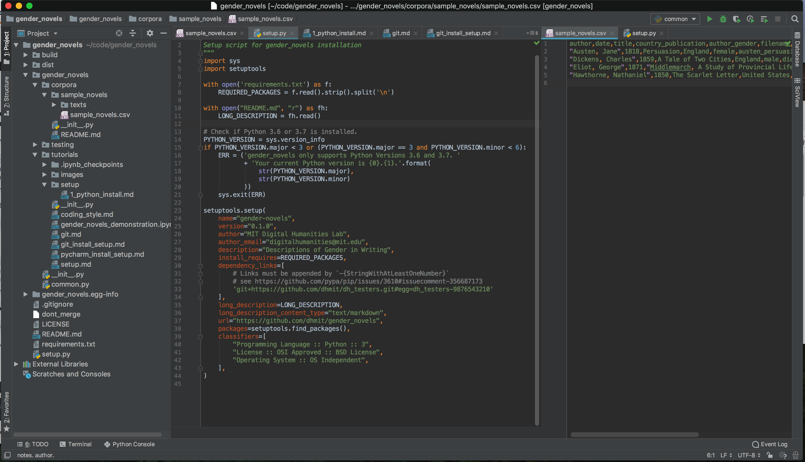
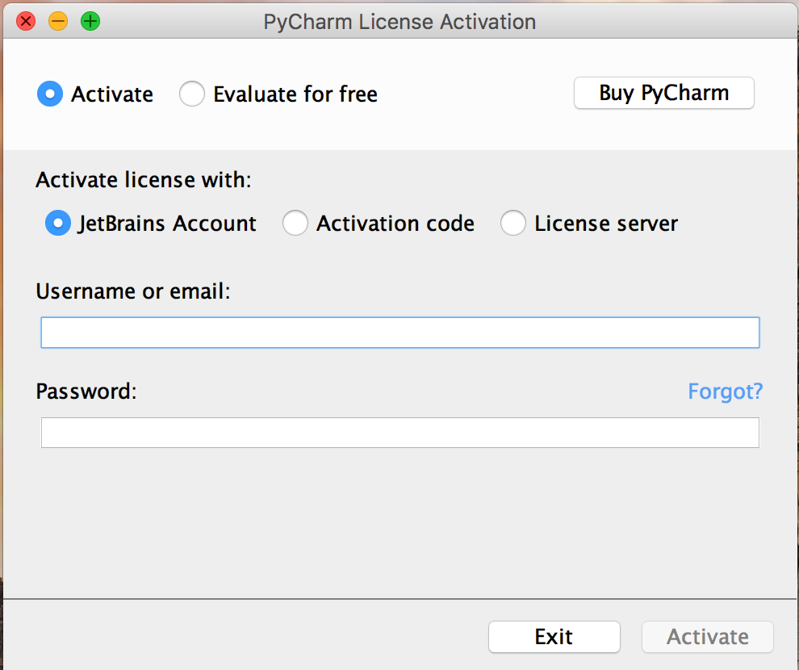
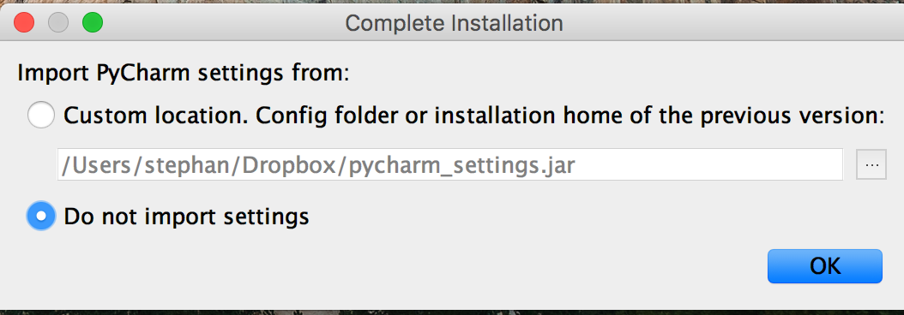
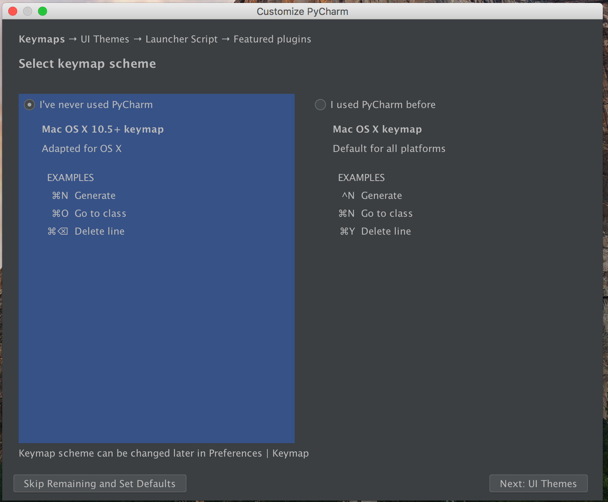
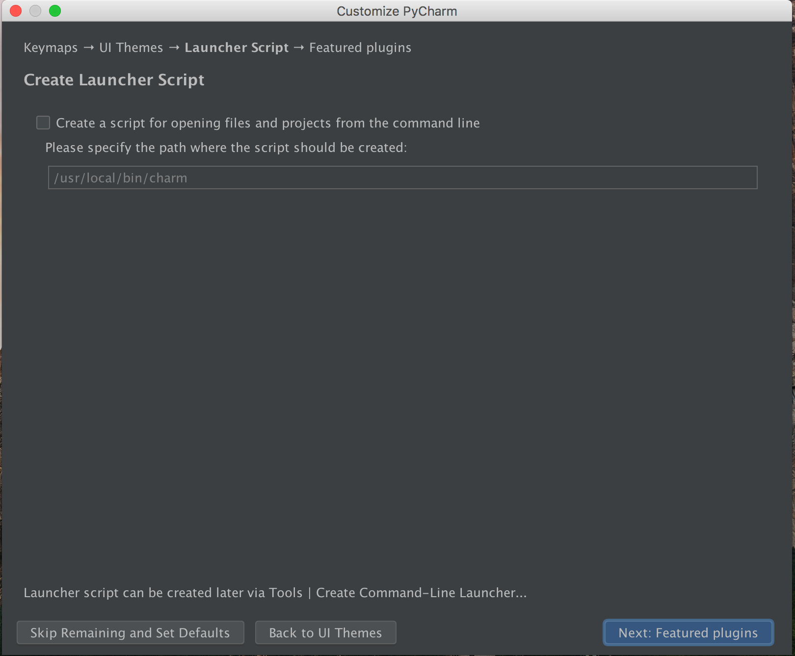
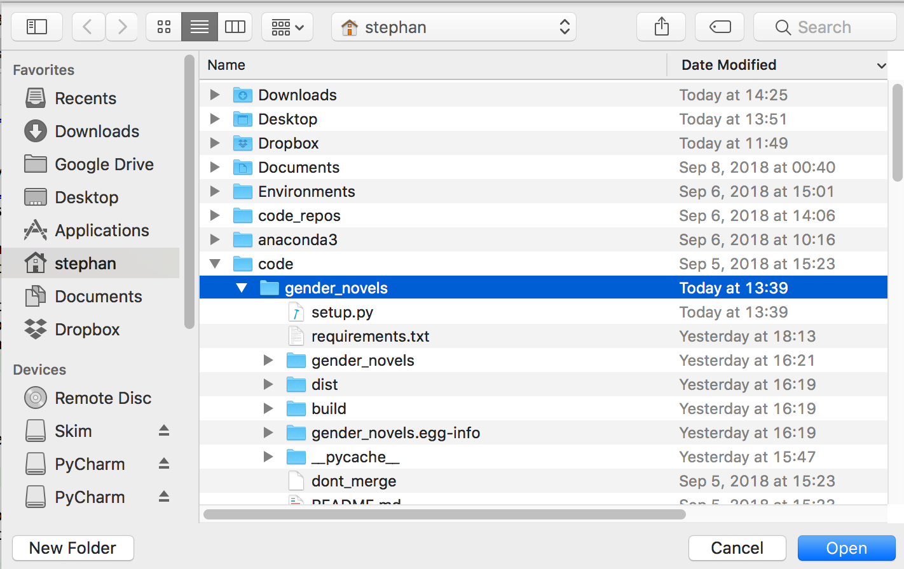
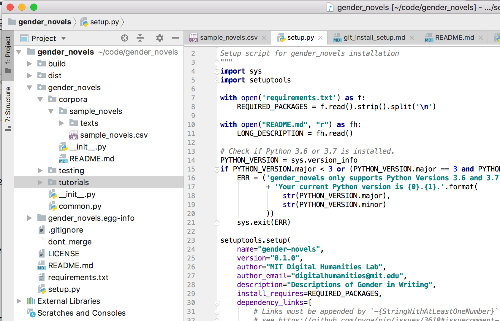

# Pycharm Installation and Setup

We will use the PyCharm IDE. An IDE (Integrated Development Environment) gives 
you the ability to write code, run it, test it, and lint it all in one place. By
standardizing the IDE across the lab, we hope to make it easier for you to work 
on code together as well as making it easier for the staff to provide support
if you run into problems.

 

#### Installation

As students, you can get PyCharm for free by 
[signing up for a student account.](https://www.jetbrains.com/student/)

Once you have signed up for an account, you can
[download Pycharm.](https://www.jetbrains.com/pycharm/download/)
Make sure that you get the Professional Edition.

The installation process differs slightly between Mac and Windows but you can 
select the default settings in both cases. 

Once the installation process is finished, open up the PyCharm application. This
will open up an activation screen. You can activate PyCharm by entering the email
and password that you used before to sign up for a Jetbrains account.

Next, you will get to a setup menu.

In the first window, select "Do not import settings". We'll import settings at a
later stage.
 

(Mac only)
Select the Mac OS X 10.5+ keymap

 

Select either the dark ("Darcula") or Light theme. (Note: you might have
to set it again later after you import )
 

Don't create a launcher script--leave the checkbox empty.
 

Click on the buttons to install Markdown and BashSupport.
 

Once the setup is finished, you will be greeted by the screen below. Select "Open" 
to select the existing gender_novels repo.

Select the path to your gender_novels repo (in my case: ~/code/gender_novels)

This will bring up the main PyCharm window with the loaded gender_novels directory
on the left.

Next, we're going to import 

Windows: File -> Settings...

End of interpreter config: click apply.
